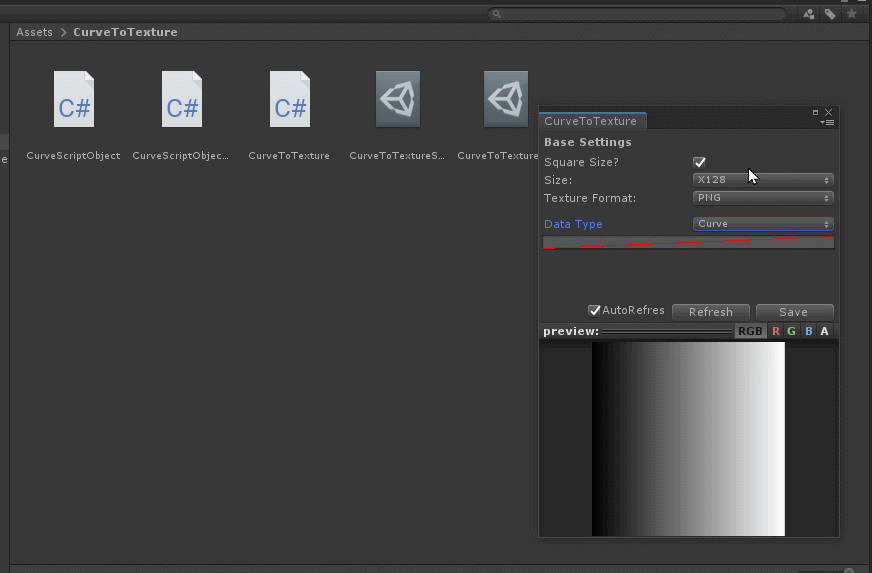
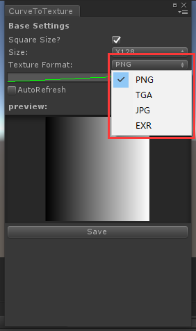
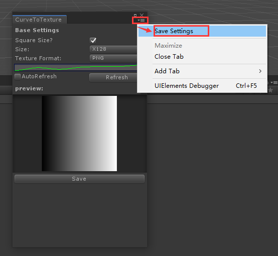
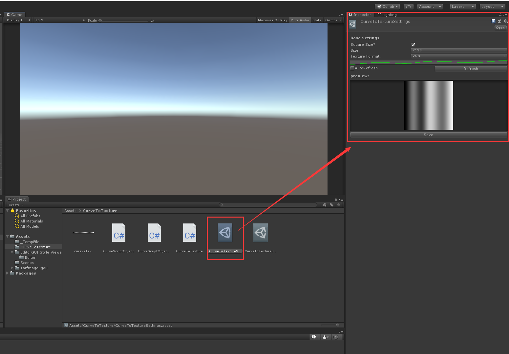
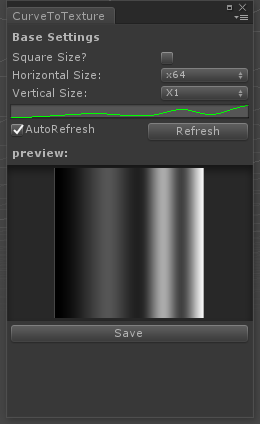

# CurveToTexture

Unity版本：2018.4.16c1

--- 

### 2022-04-12 更新
1、添加了四种不同的映射方式

<figure class = "half">
    
    
    
    
</figure>

--- 

### 2022-03-22 更新
1、添加渐变色类型

2、修改preview UI

---

### 2022-03-21 更新

1、添加了贴图保存格式的设置，可以保存为以下四种格式的贴图：

2、添加了保存配置的功能，可以把设置好的参数保存为asset文件（ScriptableObject）

选中保存好的文件可以直接在Inspector面板上使用，用法和原来的窗口是一样的

---

---

### 首次提交

Convert curves to Texture

### **在菜单"MyaTools/CurveToTexture Window"打开窗口**

